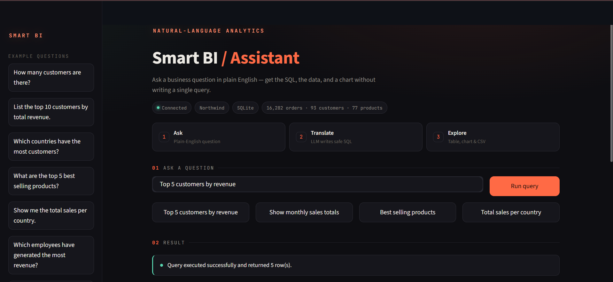
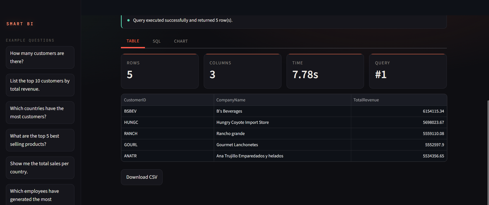
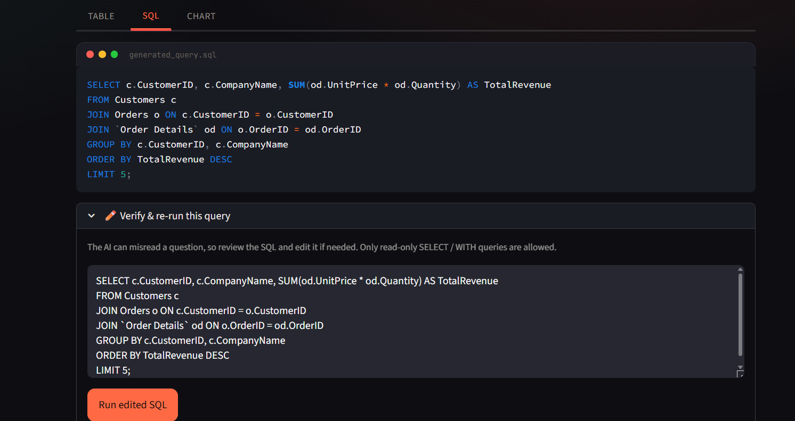

# Smart BI Assistant

A natural-language interface to a business database. You type a question like
*"which products bring in the most revenue?"* and it writes the SQL, runs it, and
shows you the answer as a table and a chart — no SQL knowledge needed.

I built this for my Master's thesis at ESTIN. It uses a language model to turn
plain English into SQL and runs everything against the Northwind sample database.

## What you can do with it

- Ask questions in English instead of writing queries by hand
- See the exact SQL it generated, and edit it yourself if it got something wrong
- Browse results as a table, download them as CSV, or switch to a chart
- Start from a set of example questions if you're not sure what to ask

## Screenshots

Ask a question in plain English:



Results come back as a table with a few quick stats and a CSV download:



The generated SQL is always shown, and you can edit and re-run it:



## Running it locally

You'll need Python and a free Hugging Face token — the app calls a model through
Hugging Face's API to generate the SQL.

Clone the repo and install the dependencies:

```bash
git clone https://github.com/houas-sarah/smart-bi-assistant.git
cd smart-bi-assistant
pip install -r requirements.txt
```

Get a token from https://huggingface.co/settings/tokens and put it in a `.env`
file in the project folder:

```
HF_API_KEY=hf_your_token_here
HF_MODEL_NAME=Qwen/Qwen2.5-Coder-32B-Instruct
```

Then run it:

```bash
streamlit run app.py
```

It opens at http://localhost:8501. The model name is optional — leave it out and
it falls back to the Qwen coder model above.

## Putting it online

The simplest option is Streamlit Community Cloud, which runs straight from a
GitHub repo:

1. Sign in at https://share.streamlit.io with your GitHub account.
2. Create an app pointing at this repo, branch `main`, main file `app.py`.
3. Under *Advanced settings → Secrets*, add the same two values as your `.env`,
   but in TOML form:

   ```toml
   HF_API_KEY = "hf_your_token_here"
   HF_MODEL_NAME = "Qwen/Qwen2.5-Coder-32B-Instruct"
   ```

4. Deploy. The token lives in Secrets and never ends up in the repo.

One thing to keep in mind: a deployed app is public by default and will use your
token for anyone who opens the link, so use a token you don't mind rotating later.

## About the database

It ships with an expanded version of Northwind, the classic sample database for a
small import/export company. This version is much bigger than the original so
that trends and aggregations are actually interesting to query — around 16,000
orders and 600,000 order lines, across 93 customers and 77 products, dated
2012 to 2023.

The data is synthetic, so don't read too much into the revenue figures. A single
"customer" pulling in millions is just an artifact of how the data was generated.

## How it works

The pipeline is short:

```
your question  →  model writes SQL  →  SQL runs on SQLite  →  table + chart
```

Two things keep it safe and honest:

- Only read-only queries run. Anything that would change the data (`DROP`,
  `DELETE`, `UPDATE`, and so on) is rejected before it reaches the database —
  whether the SQL came from the model or from you.
- The SQL is always visible. A language model can misread a question, so you can
  open the SQL tab, fix the query, and run your edited version instead.

## Is the SQL always correct?

Safety, yes — it can't modify anything. Correctness, not always. The queries are
written by a language model, so it can misunderstand a question or join the wrong
tables now and then. That's the reason the app shows you the query and lets you
edit it: think of it as a fast first draft to check, not a guaranteed answer.

## Tests

There's a small offline test suite (no API key or network needed) that covers the
query validation and the SQL-cleaning logic:

```bash
pip install -r requirements-dev.txt
pytest
```

## Things I'd add next

- Feed query errors back to the model so it can fix its own mistakes
- Support databases other than the bundled Northwind file
- Cache repeated questions
- Let the model pick the most fitting chart type for each result

## License

MIT — see the [LICENSE](LICENSE) file.

Built by Sarah Houas at ESTIN, 2025.
